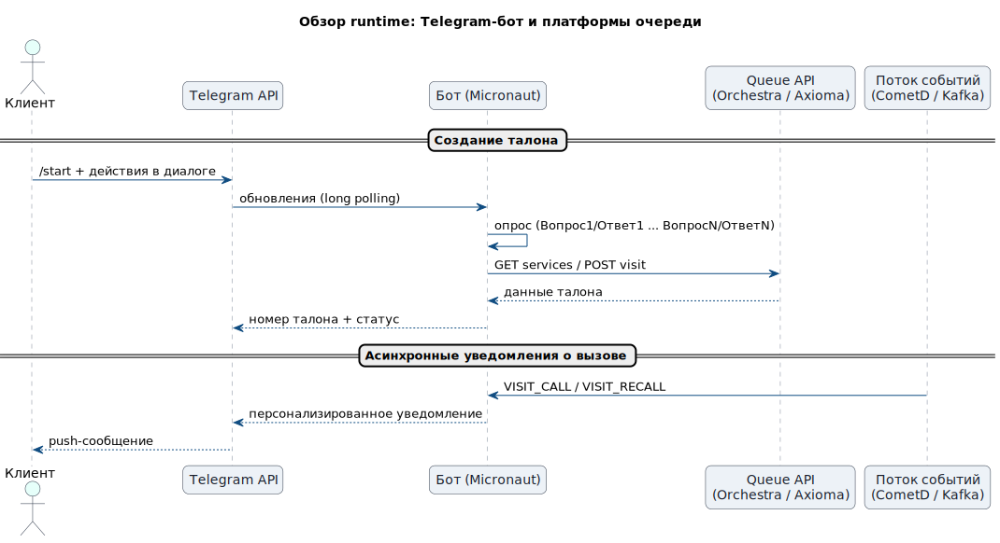
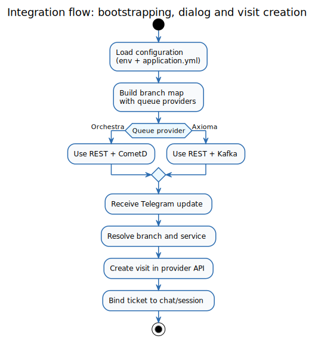
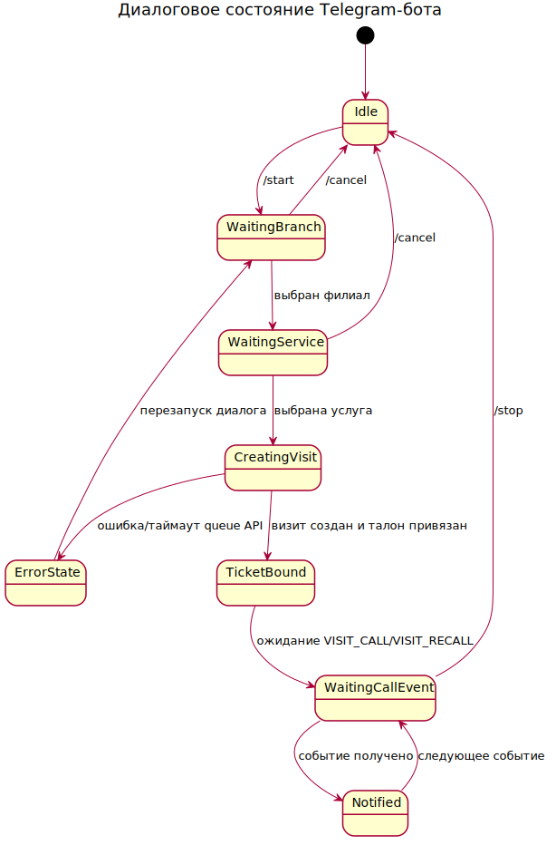
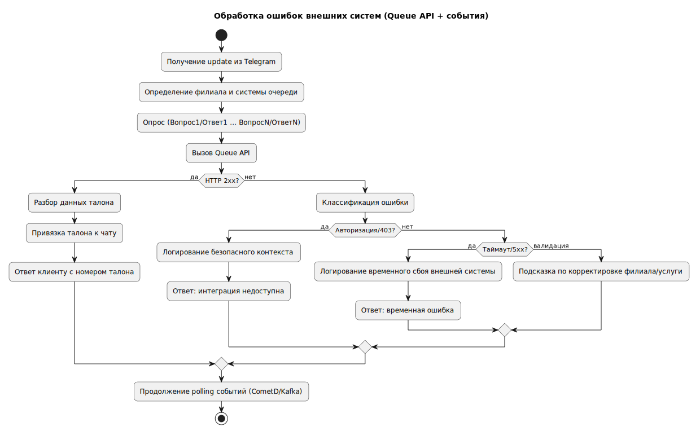
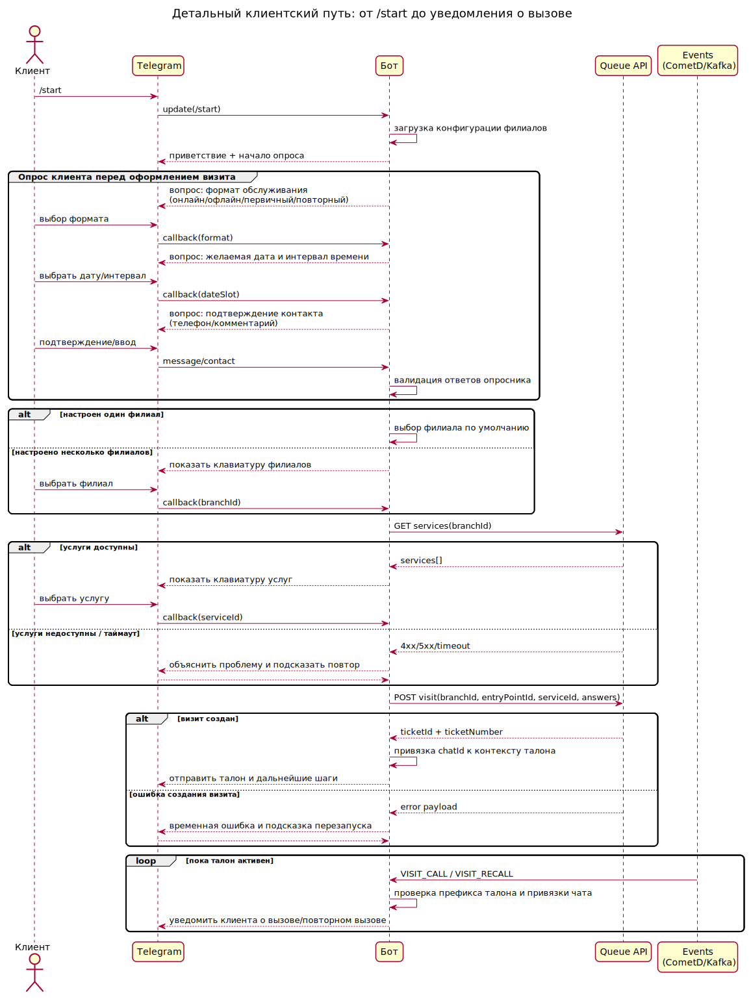
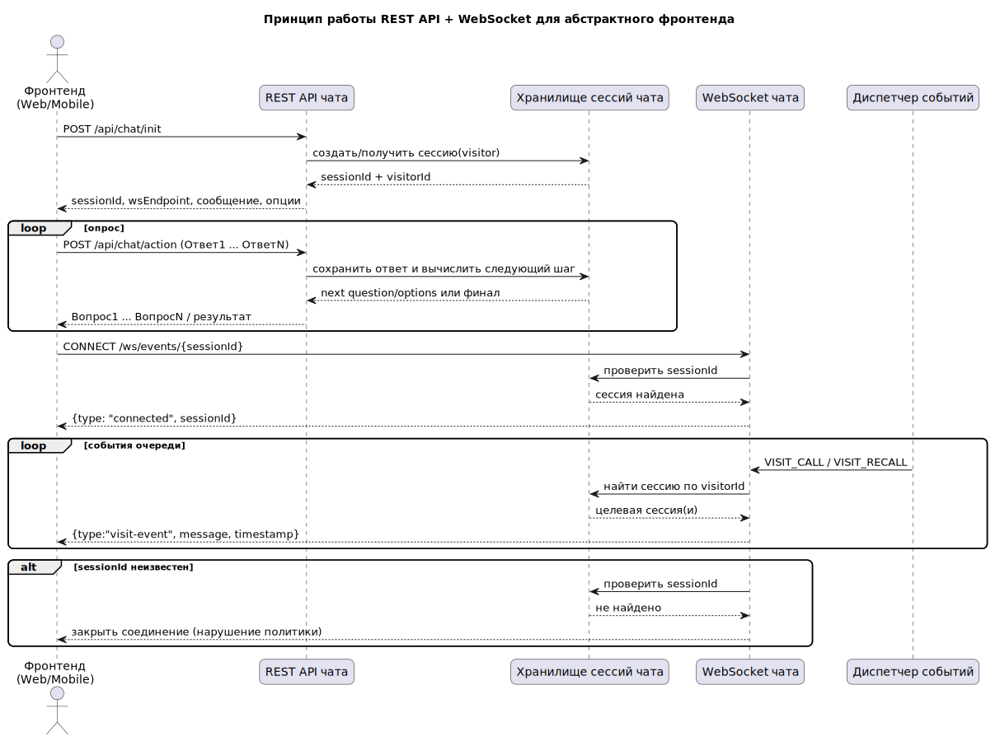

# Telegram Orchestra Bot (Java 17 + Micronaut)


Production-ready Telegram-бот для выдачи талонов и уведомлений из систем электронной очереди **Orchestra** и **Axioma**.

---

## Содержание
- [1. Что делает сервис](#1-что-делает-сервис)
- [2. Для кого этот репозиторий](#2-для-кого-этот-репозиторий)
- [3. Быстрый старт (10 минут)](#3-быстрый-старт-10-минут)
- [4. Архитектура](#4-архитектура)
- [5. Конфигурация (env + yml)](#5-конфигурация-env--yml)
- [6. Основные пользовательские сценарии](#6-основные-пользовательские-сценарии)
- [7. Эксплуатация и troubleshooting](#7-эксплуатация-и-troubleshooting)
- [8. Ролевые документы](#8-ролевые-документы)
- [9. Диаграммы и как их обновлять](#9-диаграммы-и-как-их-обновлять)
- [10. Границы и ограничения текущей реализации](#10-границы-и-ограничения-текущей-реализации)

## 1. Что делает сервис
Сервис:
1. Получает апдейты Telegram через long polling.
2. Ведёт пользователя по сценарию выбора филиала/услуги.
3. Создаёт визит (талон) в Orchestra или Axioma.
4. Сопоставляет визит с Telegram-пользователем.
5. Отправляет персональные уведомления о вызове (`VISIT_CALL`/`VISIT_RECALL`).

## 2. Для кого этот репозиторий
- **Внедрение/интеграторы** — как быстро подключить филиалы.
- **Поддержка (L1/L2)** — как диагностировать инциденты.
- **DevOps/SRE** — как эксплуатировать и мониторить.
- **Разработчики** — как устроены модули и где менять код.
- **Продажи/пресейл** — как объяснить ценность и требования.

## 3. Быстрый старт (10 минут)
### 3.1 Требования
- Java 17+
- Maven 3.9+
- Доступ к Telegram Bot API
- Доступ к Orchestra/Axioma API
- (Опционально) Kafka/CometD для событий вызова

### 3.2 Сборка
```bash
mvn -U clean test package
```

### 3.3 Запуск
```bash
java -jar target/telegram-orchestra-bot-1.0.0-SNAPSHOT.jar
```

### 3.4 Проверка готовности
```bash
curl http://localhost:8080/api/bot/status
```
Ожидается корректный JSON-ответ со статусом сервиса.

### 3.5 Запуск в Docker Compose
```bash
docker compose up -d --build
docker compose logs -f telegram-orchestra-bot
```

## 4. Архитектура
### 4.1 Высокоуровнево
- **Вход:** Telegram updates (long polling).
- **Интеграция очереди:** REST Orchestra/Axioma.
- **События вызова:** CometD (Orchestra) и Kafka (Axioma).
- **Конфигурация:** `application.yml` + env.

### 4.2 Карта модулей
- `telegram/` — polling, state machine, keyboard.
- `queue/` — REST-шлюз к системам очереди.
- `events/` — нормализация и диспетчеризация событий вызова.
- `cometd/` — подписка на Orchestra event stream.
- `kafka/` — consumer для Axioma событий.
- `path/` — сценарий клиентского пути из YAML.
- `config/` — конфигурация, парсинг branch settings.








### 4.3 Принцип работы REST API + WebSocket для абстрактного frontend (web/mobile)
Бэкенд разделяет взаимодействие на две части:
1. **REST (`/api/chat/*`)** — синхронные шаги диалога (инициализация сессии, отправка действий/ответов, получение next question/options).
2. **WebSocket (`/ws/events/{sessionId}`)** — асинхронные push-события по уже созданной сессии (вызов посетителя, повторный вызов, сервисные статусы канала).

Базовые принципы интеграции для любого frontend:
- **Session-first:** сначала `POST /api/chat/init`, только потом открывать WS.
- **Single source of truth:** `sessionId` из REST-ответа используется как ключ в URL WebSocket и для восстановления состояния UI.
- **Resilience:** при реконнекте frontend повторно открывает тот же `sessionId`; при закрытии с ошибкой и истёкшей сессии — делает повторный `init`.
- **Transport split:** бизнес-команды пользователя идут через REST, а события внешних систем (Kafka/CometD) приходят только через WS.
- **UI-agnostic contract:** формат событий (`type`, `message`, `timestamp`, `sessionId`) одинаково применим для браузера и мобильного клиента.


#### 4.3.1 Текстовые примеры работы с REST API
**Пример 1: Инициализация сессии**
```bash
curl -X POST http://localhost:8080/api/chat/init \
  -H "Content-Type: application/json" \
  -d '{
    "channel": "web",
    "visitor": {
      "externalId": "user-42",
      "displayName": "Ivan"
    }
  }'
```
Ожидаемая идея ответа (поля могут отличаться по конкретной реализации):
```json
{
  "sessionId": "2f1a5f4e-4af1-4e5b-8a2b-8e1f1bda8f2d",
  "visitorId": "visitor-42",
  "message": "Выберите филиал",
  "options": [
    {"id":"branch-1","label":"Центральный"},
    {"id":"branch-2","label":"Северный"}
  ],
  "wsEndpoint": "/ws/events/2f1a5f4e-4af1-4e5b-8a2b-8e1f1bda8f2d"
}
```

**Пример 2: Отправка действия пользователя**
```bash
curl -X POST http://localhost:8080/api/chat/action \
  -H "Content-Type: application/json" \
  -d '{
    "sessionId": "2f1a5f4e-4af1-4e5b-8a2b-8e1f1bda8f2d",
    "action": "select_option",
    "payload": {"optionId": "branch-1"}
  }'
```
Ожидаемая идея ответа: следующий вопрос/шаг сценария (`message`, `options`, `inputType`) или финальный результат (например, номер талона).

#### 4.3.2 Текстовые примеры работы с WebSocket
**Пример 1: Подключение к каналу событий**
```text
GET ws://localhost:8080/ws/events/2f1a5f4e-4af1-4e5b-8a2b-8e1f1bda8f2d
```
Первое служебное сообщение сервера:
```json
{"type":"connected","sessionId":"2f1a5f4e-4af1-4e5b-8a2b-8e1f1bda8f2d"}
```

**Пример 2: Push-событие вызова посетителя**
```json
{
  "type": "visit-event",
  "event": "VISIT_CALL",
  "message": "Клиент A123, пройдите к окну 4",
  "timestamp": "2026-05-15T10:20:31Z"
}
```

**Пример 3: Ошибка при невалидной сессии**
Если `sessionId` не найден, сервер закрывает сокет при открытии соединения (обычно с кодом policy violation). В этом случае frontend должен вызвать `POST /api/chat/init` повторно и открыть новое WS-соединение уже с новым `sessionId`.

## 5. Конфигурация (env + yml)
### 5.1 Где что настраивается
- `src/main/resources/application.yml` — базовые ключи и значения по умолчанию.
- `.env` — переменные окружения для локального запуска и docker-compose.
- `client_path.yml` — сценарий вопросов/ответов клиента.

### 5.2 Ключевые группы параметров
- `bot.telegram.*` — токен, polling и endpoint Telegram.
- `bot.queue.*` — настройки Orchestra/Axioma, branch fallback, credentials.
- `bot.runtime.*` — настройки клиентского пути, шаблоны, blacklists.
- `bot.cometd.*` — параметры подписки на Orchestra события.
- `bot.kafka.*` — настройки Kafka consumer.

### 5.3 Multi-branch
Используется `ORCHESTRA_BRANCHES` (JSON-массив).
Минимально у филиала должны быть:
- `id`
- `entry_point_id`
- `queue_system` (`orchestra` | `axioma`)
- `base_url`
- `login` / `password`


### 5.4 Правила написания `client_path.yml`
`client_path.yml` описывает опросник как последовательность шагов и переходов. Чтобы сценарий был стабильным и поддерживаемым, соблюдайте правила:

1. **Один шаг — один смысловой вопрос.**
   - Не объединяйте в один шаг несколько независимых вопросов.
   - Для каждого шага задавайте понятный `message` и отдельные `options`/тип ввода.

2. **Стабильные идентификаторы шагов и ответов.**
   - Используйте машинные ключи в `snake_case` (`choose_branch`, `select_service`, `confirm_contact`).
   - Не переименовывайте существующие ключи без миграции: на них могут ссылаться переходы и аналитика.

3. **Явные переходы для каждой ветки.**
   - У каждого ответа должен быть определён `next_step`.
   - Для ошибок/невалидного ввода добавляйте fallback-переход (повтор шага или переход в error-step).

4. **Валидации рядом с шагом.**
   - Для свободного ввода (телефон, комментарий, дата/интервал) задавайте ограничения: формат, длину, обязательность.
   - Тексты ошибок делайте пользовательскими, без технических деталей.

5. **Разделяйте UI-текст и интеграционные значения.**
   - Пользователь видит локализованный `label`.
   - В Queue API отправляется стабильный `value` (код услуги, режим, тип визита).

6. **Совместимость с multi-branch.**
   - Шаг выбора филиала должен корректно работать в двух режимах: один филиал (автовыбор) и несколько филиалов (клавиатура).
   - Не хардкодьте branch-specific значения в общих шагах опросника.

7. **Идемпотентность и перезапуск.**
   - Повтор `/start` должен безопасно сбрасывать сценарий в начальный шаг.
   - После ошибки upstream опросник должен либо продолжиться с последнего валидного шага, либо корректно начаться заново.

8. **Версионирование изменений сценария.**
   - Любое изменение шага/перехода фиксируйте в PR с описанием влияния на текущих пользователей.
   - Проверяйте, что обновлённый `client_path.yml` не ломает happy path и error branches из раздела 6.

## 6. Основные пользовательские сценарии
### 6.1 Happy path
1. Пользователь отправляет `/start`.
2. Выбирает филиал.
3. Проходит опросник перед визитом:
   - формат обслуживания (например, первичный/повторный),
   - желаемые дата и интервал,
   - подтверждение контактных данных и комментарий.
4. Выбирает услугу (или несколько услуг при соответствующем режиме).
5. Бот валидирует ответы опросника, создаёт визит и возвращает номер талона.
6. При вызове бот отправляет персональное уведомление.

### 6.2 Ошибочные ветки
- Услуги не загрузились → показать fallback-сообщение и записать ошибку в лог.
- Визит не создался → вернуть пользователю понятное сообщение без технических деталей.
- Не найден chat binding для события вызова → событие логируется, пользователю ничего не отправляется.

### 6.3 REST API + WebSocket сценарий для web-клиента
1. Фронтенд вызывает `POST /api/chat/init` и получает `sessionId`, `visitorId`, `message`, `options`, `wsEndpoint`.
2. Фронтенд подключается к `ws://<host>:<port><wsEndpoint>`.
3. Сервер отправляет техническое сообщение `{"type":"connected","sessionId":"..."}`.
4. По мере обработки событий очереди посетитель получает сообщения `{"type":"visit-event","message":"...","timestamp":"..."}`.
5. Если `sessionId` не существует, WebSocket соединение закрывается на этапе `OnOpen`.

### 6.4 Что покрыто тестами
- REST контроллеры:
  - `ChatCoreController`: init, legacy action parsing, bad-request handler.
  - `StatusController`: формирование status-ответа и branch views.
- WebSocket:
  - регистрация/дерегистрация сокета;
  - отклонение неизвестной сессии;
  - broadcast в несколько соединений одной сессии.
- Контроллер обработки Telegram callbacks/messages:
  - happy path `/start`;
  - ошибка выбора несуществующего филиала.

## 7. Эксплуатация и troubleshooting
### 7.1 Быстрый чек (L1)
1. Проверить `/api/bot/status`.
2. Проверить логи приложения.
3. Проверить доступность upstream API.
4. Проверить корректность branch-конфига.

### 7.2 Типовые причины инцидентов
- Неверные credentials к queue API.
- Ошибка `branchId`/`entryPointId` в конфигурации.
- Недоступный Kafka broker или проблемы подписки CometD.
- Сетевые таймауты между ботом и upstream.

### 7.3 Что передавать при эскалации
- Timestamp (UTC).
- Branch ID + queue system.
- Chat ID (маскированно при необходимости).
- HTTP status/response фрагменты.
- Лог-фрагмент/stack trace.

## 8. Ролевые документы
- Поддержка:
  - `docs/roles/support-quick.md`
  - `docs/roles/support-detailed.md`
- Внедрение:
  - `docs/roles/implementation-quick.md`
  - `docs/roles/implementation-detailed.md`
- Разработка: `docs/roles/development.md`
- DevOps: `docs/roles/devops.md`
- Продажи: `docs/roles/sales.md`

## 9. Диаграммы и как их обновлять
### 9.1 Исходники
- `docs/diagrams-src/runtime-overview.puml`
- `docs/diagrams-src/integration-flow.puml`
- `docs/diagrams-src/dialog-state-machine.puml`
- `docs/diagrams-src/error-handling-flow.puml`
- `docs/diagrams-src/client-journey-detailed.puml`
- `docs/diagrams-src/rest-ws-frontend-flow.puml`

### 9.2 Генерация SVG
```bash
plantuml -tsvg docs/diagrams-src/runtime-overview.puml docs/diagrams-src/integration-flow.puml docs/diagrams-src/dialog-state-machine.puml docs/diagrams-src/error-handling-flow.puml docs/diagrams-src/client-journey-detailed.puml docs/diagrams-src/rest-ws-frontend-flow.puml -o ../diagrams
```

### 9.3 Проверка
После генерации убедитесь, что обновились именно SVG-файлы, которые используются в README:
- `docs/diagrams/runtime-overview.svg`
- `docs/diagrams/integration-flow.svg`
- `docs/diagrams/dialog-state-machine.svg`
- `docs/diagrams/error-handling-flow.svg`
- `docs/diagrams/client-journey-detailed.svg`
- `docs/diagrams/rest-ws-frontend-flow.svg`

Дополнительно (если используете расширенный комплект схем), проверьте наличие:
- `docs/diagrams/network-flow.svg`
- `docs/diagrams/cometd-sequence.svg`
- `docs/diagrams/ticket-sequence.svg`

> В `README.md` диаграммы должны размещаться ссылками на `.svg` из `docs/diagrams/`.

## 10. Границы и ограничения текущей реализации
- Состояние пользователей хранится в памяти процесса (после рестарта сценарий начинается заново).
- Long polling выполняется в одном процессе/контуре без внешней очереди апдейтов.
- Для production рекомендуется:
  - вынести секреты в secret manager,
  - хранить состояние пользователей во внешнем storage (например, Redis/JDBC),
  - настроить мониторинг и алертинг на upstream ошибки.
